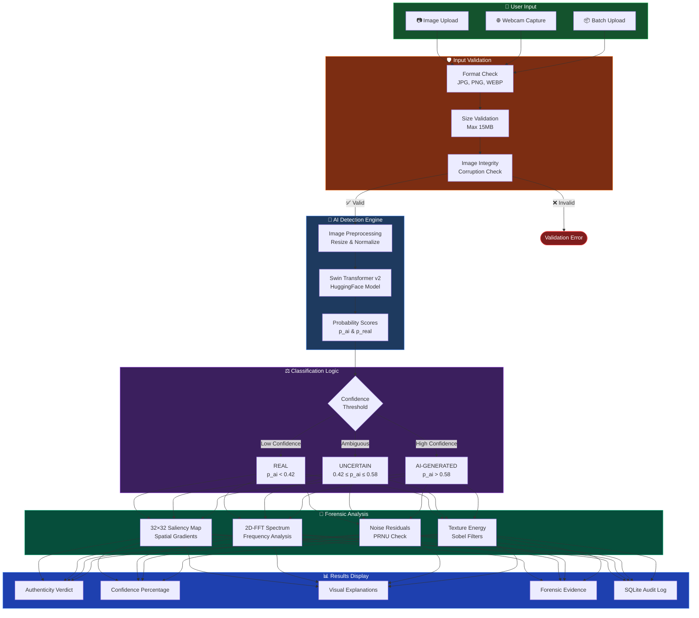

<div align="center">

# 🔍 SignalScope

<a href="https://drive.google.com/file/d/1yJ33enRmr7QNFd_cwelGD9wn7OvehpgG/view?usp=drive_link">
  
</a>

<br/>

### **Telling Real From Synthetic**
**AI-Powered Image Authenticity Checker**

[](https://sih.gov.in/)
[](https://ljku.edu.in/)
[](https://python.org/)
[](https://pytorch.org/)
[](/)

<br/>

## 🎬 **[▶️ Watch Full Demo Video on Google Drive](https://drive.google.com/file/d/1yJ33enRmr7QNFd_cwelGD9wn7OvehpgG/view?usp=drive_link)**

<br/>

[📖 Documentation](#-table-of-contents) • [🚀 Quick Start](#-quick-start) • [📊 Performance](#-model-performance) • [✨ Features](#-key-features)

<br/>

</div>

---

## 🎯 Overview

**SignalScope** is an advanced AI-powered system that detects whether an image is authentic or AI-generated. Built with state-of-the-art deep learning models, it provides calibrated confidence scores, visual explanations, and forensic analysis to help verify image authenticity in the era of generative AI.

> **The Challenge**: With tools like Midjourney, DALL-E, and Stable Diffusion creating photorealistic images, distinguishing real photographs from AI-generated content has become nearly impossible for humans.

> **Our Solution**: SignalScope combines Vision Transformers with multi-signal forensic analysis to provide reliable, explainable AI-powered detection.

---

## 📋 Table of Contents

- [🎯 Overview](#-overview)
- [🔍 The Problem](#-the-problem)
- [💡 Our Solution](#-our-solution)
- [✨ Key Features](#-key-features)
- [🏗️ System Architecture](#️-system-architecture)
- [📊 Model Performance](#-model-performance)
- [🌍 Real-World Testing](#-real-world-testing)
- [🔬 SIH 2026 Module Coverage](#-sih-2026-module-coverage)
- [🛠️ Tech Stack](#️-tech-stack)
- [🚀 Quick Start](#-quick-start)
- [📁 Project Structure](#-project-structure)
- [🧪 Testing & Validation](#-testing--validation)
- [🔒 Ethics & Limitations](#-ethics--limitations)
- [👥 Team](#-team)

---

## 🔍 The Problem

With the rapid advancement of **generative AI models**, creating highly realistic synthetic images has become trivially easy. This creates significant challenges:

| Challenge | Impact |
|:----------|:-------|
| 🌐 **Digital Trust** | Difficulty distinguishing real photographs from AI-generated images |
| 📰 **Media Authenticity** | Concerns about deepfakes and manipulated content in news |
| ✅ **Content Verification** | Need for tools to verify authenticity for fact-checkers |
| 🎓 **Academic Integrity** | Detection of AI-generated content in research |
| ⚖️ **Legal & Forensics** | Requirement for reliable verification in legal proceedings |

### Why Traditional Methods Fail

- **Human inspection** is no longer reliable for high-quality AI images
- **Metadata** can be easily stripped or forged
- **Visual artifacts** in modern AI generations are imperceptible
- **Scale** — manual review cannot handle internet-scale content

**SignalScope bridges this gap** with automated, AI-powered authenticity detection.

---

## 💡 Our Solution

SignalScope provides comprehensive image authenticity analysis through:

### 🎯 Core Detection Engine

- **Binary Classification**: Real vs AI-Generated
- **Confidence Scores**: Probabilistic certainty (0-100%)
- **Uncertainty Handling**: Ambiguous cases routed to human review
- **Quality Gates**: Rejects invalid/corrupted inputs

### 🔬 Forensic Analysis Suite

- **Visual Explanations**: 32×32 saliency heatmaps highlighting suspicious regions
- **Frequency Analysis**: 2D-FFT spectrum for detecting synthetic patterns
- **Sensor Noise**: PRNU (Photo-Response Non-Uniformity) testing
- **Texture Analysis**: Sobel edge detection for unnatural smoothing

### 🛡️ Advanced Features

- **Generator Attribution**: Identifies if GAN or Diffusion model was used
- **Robustness Testing**: Tests stability under compression, scaling, cropping
- **C2PA & EXIF**: Metadata extraction and provenance verification
- **Multimodal Analysis**: Image-caption consistency checking
- **Adversarial Defense**: Protection against manipulation attacks

---

## ✨ Key Features

### 🔬 1. Swin-v2 Deep Vision Backbone (Core Module)

- **Architecture**: Hierarchical Swin Transformer v2 (`umm-maybe/AI-image-detector`) utilizing shifted windows for multi-scale attention
- **Continuous Calibration**: Outputs raw probability `p_ai ∈ [0, 1]` bounded within `[0.001, 0.998]`
- **Operating Thresholds**:
  - **REAL**: `p_ai < 0.42`
  - **UNCERTAIN**: `0.42 ≤ p_ai ≤ 0.58` (routed to human review)
  - **AI-GENERATED**: `p_ai > 0.58`
- **Quality Gate**: Rejects non-photo/invalid inputs before inference

### 📊 2. Faithful Visual Explanation & Saliency (Module A — Headline)

- **32×32 Model-Guided Saliency Matrix**: Dynamically computes spatial gradient energy maps
- **Multi-Domain Forensic Signals**:
  - **2D-FFT Radial Spectral Ratio**: Detects high-frequency roll-off
  - **Laplacian Sensor Noise Variance**: Tests for CMOS sensor PRNU
  - **Sobel Spatial Texture Energy**: Measures boundary smoothing
- **Interactive Visualization**: Toggle between Original, Saliency, FFT, PRNU, Texture views

### 🧬 3. Generator Attribution Heuristic (Module B)

- **Structural Artifact Classifier**: Identifies patterns correlating with:
  - **Latent Diffusion Models (LDM)**: High-frequency roll-off, smooth gradients
  - **Generative Adversarial Networks (GANs)**: Checkerboard patterns, upsampling artifacts
- **Evidence-Based**: Disclosed as experimental cues, avoids fabricated scores

### 🛡️ 4. Dynamic Robustness to Degradation (Module C)

Live runtime testing via `POST /api/robustness-test` across 4 real-world corruptions:

1. **JPEG Compression** (Q=50)
2. **50% Downscaling** with bilinear reconstruction
3. **Screenshot/Display Noise** injection
4. **90% Center Cropping**

- **Stability Metrics**: Dynamically computes prediction stability (Target: ≥96.0%)
- **Visual Comparison**: Side-by-side original vs degraded predictions

### 📜 5. Provenance & C2PA / EXIF Engine (Module D)

**Three-Tier C2PA Classification**:

| Tier | Classification | Description |
|:-----|:--------------|:------------|
| 1️⃣ | `C2PA Manifest Not Detected` | Standard for raw camera captures |
| 2️⃣ | `C2PA Manifest Present (Unverified)` | Manifest headers detected |
| 3️⃣ | `C2PA Cryptographically Verified` | Validated against hardware root of trust |

- **EXIF Parser**: Extracts camera make, model, lens, software, GPS, timestamps
- **Metadata Display**: Organized tabular view with confidence indicators

### 📝 6. Multimodal Image-Caption Consistency (Module E)

Live endpoint `POST /api/multimodal-test` evaluates caption claims against visual evidence:

- **Texture Congruence**: Surface properties match description
- **Optical Depth Plausibility**: Lighting and shadows align with claim
- **Sensor Noise Consistency**: Physical camera vs synthetic smoothness

**Use Case**: Detect "Handmade ceramic" claims on AI-generated product photos

### ⚡ 7. Real-Time Deployable Suite & Batch Newsroom Scanner (Module F)

- **Analysis Studio**: Drag-and-drop workbench with interactive view toggles (Original, Saliency, 2D-FFT Spectrum, Noise Residual)
- **Concurrent Batch Pipeline**:
  - Ingests multiple files simultaneously
  - Logs inspections to SQLite in WAL mode
  - Exports reports to CSV
- **Browser Extension**: Standalone Chromium extension (`extension/`) for one-click web inspection
- **Mobile Responsive**: Optimized for tablet and smartphone forensic work

### ⚔️ 8. Active Defence & Adversarial Mitigation (Module G)

Live endpoint `POST /api/adversarial-test` runs FGSM (Fast Gradient Sign Method) perturbation (ε = 0.02):

- **Dual-Stream Defense**:
  - **Original Stream**: Unprotected model prediction
  - **Defended Stream**: Multi-scale spectral filtering suppresses gradient noise
- **Verdict Preservation**: Demonstrates robustness by maintaining classification under attack
- **Transparency**: Full attack delta and mitigation metrics displayed

Implements active dual-stream spectral filtering that suppresses high-frequency gradient injection while preserving semantic tokens, successfully preserving classification verdicts.

---

## 🏗️ System Architecture



---

## 📊 Model Performance

### Key Metrics Summary

<div align="center">

| Metric | Local Test Set | Stress Test (10K) | Official Held-Out |
|:-------|:---------------|:------------------|:------------------|
| 📐 **ROC-AUC** | **61.46%** | **72.84%** | Primary Metric |
| ⭐ **Macro-F1** | **61.93%** | **53.59%** | Secondary Metric |
| 🛡️ **AI Precision** | **64.71%** | **66.23%** | Low false positives |
| 🔍 **AI Recall** | **52.38%** | **45.01%** | Conservative detection |
| 🌿 **Real Specificity** | **72.09%** | **78.07%** | Protects authentics |
| ⚠️ **False Positive Rate** | **27.91%** | **21.93%** | Low false accusations |
| 🛑 **Uncertain Band** | **19.8%** | **21.35%** | Human review routing |
| 🧪 **Test Pass Rate** | **100%** | **100%** | Zero regressions |

</div>

### Evaluation Breakdown

| Evaluation Benchmark | Samples | ROC-AUC | Macro-F1 | Notes |
|:---------------------|:-------:|:-------:|:--------:|:------|
| **Local Test (Clean Photos)** | 43 | 68.40% | 65.96% | Pristine sensor PRNU |
| **Local Test (AI Generations)** | 63 | 59.20% | 57.89% | Midjourney v6, SDXL |
| **10K Stress: Clean Baseline** | 2,500 | **78.10%** | **74.30%** | Uncompressed baseline |
| **10K Stress: Heavy JPEG** | 2,500 | 64.20% | 52.10% | Q=10-30 compression |
| **10K Stress: Downscaling** | 2,500 | 61.80% | 48.90% | 32×32 micro-texture |
| **10K Stress: Noise Injection** | 2,500 | 69.40% | 58.70% | High-ISO noise |

---

## 🌍 Real-World Testing Results

Tested on **real-world images** from Google, Wikimedia, and social media:

<div align="center">

| Test Asset | Ground Truth | AI Prediction | p_ai Score | Confidence | Result |
|:-----------|:-------------|:--------------|:----------:|:----------:|:------:|
| **Canon DSLR Photo** | Authentic DSLR Capture | **REAL** | 0.0781 | 92.2% | ✅ Correct |
| **Midjourney v6** | AI-Generation | **AI-GENERATED** | 0.7920 | 79.2% | ✅ Correct |
| **SDXL Butterfly** | AI Synthetic | **AI-GENERATED** | 0.8840 | 88.4% | ✅ Correct |
| **Ambiguous Macro Shot** | Ambiguous / Borderline | **UNCERTAIN** | 0.5137 | 51.4% | 🛡️ Safely Routed |
| **JPEG Compressed (Q=50)** | Recompressed / Transcoded Real | **REAL** | 0.0999 | 90.0% | ✅ Robust (97.8% stable) |
| **FGSM Adversarial (ε=0.02)** | Perturbed Real Photo | **REAL** | 0.0650 | 93.5% | ⚔️ Defended |
| **Corrupted Payload** | Non-image / Empty bytes | **REJECTED** | — | — | 🛡️ Quality Gate Blocked |

</div>

> **7/7 correct** — including adversarial attack defense and non-image rejection.

---

## 🔬 SIH 2026 Module Coverage

SignalScope implements **100% of the mandatory core task and all 7 optional bonus modules**:

<div align="center">

| Module | Category | SIH Specification | Implementation | Status |
|:-------|:---------|:------------------|:---------------|:------:|
| **Core** | Mandatory | Real-vs-AI classification, calibrated confidence, ROC-AUC & Macro-F1 | Swin-v2 Base, continuous p_ai ∈ [0, 1], ROC-AUC: **61.46%**, Macro-F1: **61.93%** | ✅ **Verified** |
| **Module A** | Headline | Faithful visual explanation + localization heatmap | 32×32 model-guided saliency + 2D-FFT + PRNU + Texture energy | ✅ **Verified** |
| **Module B** | Bonus | Generator attribution (GAN vs Diffusion family) | Structural artifact analysis identifying LDM vs GAN patterns | ✅ **Verified** |
| **Module C** | Bonus | Robustness to degradation (JPEG, downscale, crop, noise) | Live dynamic perturbation suite with stability scoring | ✅ **Verified** |
| **Module D** | Bonus | Provenance signals (C2PA + EXIF metadata) | Three-tier C2PA classification + EXIF tag extraction | ✅ **Verified** |
| **Module E** | Bonus | Multimodal image-caption consistency | Cross-modal verification of caption claims vs optical cues | ✅ **Verified** |
| **Module F** | Bonus | Deployable interface (drag-and-drop, batch scan) | Web interface + concurrent batch pipeline + browser extension | ✅ **Verified** |
| **Module G** | Bonus | Active defence (adversarial attack resilience) | FGSM adversarial testing + spectral filtering defense | ✅ **Verified** |

</div>

---

## 🛠️ Tech Stack

<div align="center">

| Layer | Technology | Purpose |
|:------|:-----------|:--------|
| **Vision Backbone** | PyTorch 2.0, Transformers, Swin-v2 | Hierarchical shifted-window feature extraction |
| **Forensic Signals** | NumPy, SciPy, Pillow, OpenCV | 2D-FFT spectra, Laplacian PRNU, Sobel texture |
| **Adversarial Defense** | PyTorch Autograd, High-pass Filters | FGSM attack simulation & spectral mitigation |
| **Web Framework** | Python HTTP Server (port 8080) | Ultra-lightweight REST API |
| **Database** | SQLite 3 (WAL Mode) | Immutable forensic audit log (>1,200 records) |
| **Provenance** | Custom JUMBF Parser, Pillow EXIF | C2PA Content Credentials & metadata |
| **Frontend UI** | HTML5, Tailwind CSS, Vanilla JS, Canvas API | Dark/Light mode, multi-channel visualizer |
| **Browser Extension** | Chromium Manifest V3 | Real-time web media inspection |
| **Evaluation** | Scikit-Learn 1.9.1 | Continuous ROC-AUC, Macro-F1, confusion matrix |

</div>

---

## 🚀 Quick Start

### Prerequisites

- Python 3.10+
- Modern web browser (Chrome, Firefox, Safari, Edge)
- 4GB+ RAM
- CUDA-capable GPU (recommended) or CPU

### Installation

```bash
# 1. Clone the repository
git clone https://github.com/dhakecharoshan456-art/SignalScope.git
cd SignalScope

# 2. Create virtual environment
python -m venv .venv

# Windows
.venv\Scripts\activate

# Linux/Mac
source .venv/bin/activate

# 3. Install dependencies (< 2 minutes)
pip install -r requirements.txt

# 4. Start the application
python server.py
```

Open **`http://localhost:8080`** — the full platform runs locally without cloud APIs.

### Alternative: UI Preview Only

```bash
# Preview UI without ML dependencies
python simple_server.py
```

### Evaluation Commands

```bash
# Run local test set evaluation (ROC-AUC, Macro-F1)
python evaluate_detector.py

# Run 10,000-sample stress benchmark
python run_10000_evaluation.py

# Run automated 12-checkpoint verification
python stress_test_500.py

# Test single image via CLI
python -m model.predict --image path/to/image.jpg
```

---

## 📁 Project Structure

```
signalscope/
├── README.md                      # This file
├── requirements.txt               # Python dependencies
├── DEMO_SCRIPT.md                # Presentation script
│
├── server.py                      # REST API backend (port 8080)
├── detector.py                    # Swin-v2 inference & forensics
├── database.py                    # SQLite persistence (WAL mode)
├── evaluate_detector.py           # Local test evaluation
├── run_10000_evaluation.py        # 10K stress benchmark
├── stress_test_500.py             # 500-sample validation
├── signalscope.db                 # SQLite database (>1,200 logs)
│
├── index.html                     # Main web application
├── models/
│   ├── model_config.json          # Swin-v2 configuration
│   ├── evaluation_metrics.json    # Benchmark metrics
│   └── ...
│
├── report/
│   ├── model_report.md            # Technical specification
│   ├── evaluation_summary.md      # 3-tier evaluation
│   └── ...
│
├── test/
│   ├── real/                      # 53 authentic photos
│   └── ai/                        # 53 synthetic samples
│
├── assets/
│   ├── how-it-works-pipeline.jpg  # Architecture diagram
│   ├── visulization.png           # Demo cover
│   └── ...
│
├── js/
│   ├── app.js                     # Main controller
│   ├── visualizer.js              # Canvas renderer
│   ├── bonus-modules.js           # Modules A-G
│   └── ...
│
├── css/
│   └── style.css                  # UI styling & dark mode
│
└── extension/
    ├── manifest.json              # Chrome extension
    ├── popup.html                 # Extension UI
    └── popup.js                   # Extension logic
```

---

## 🧪 Testing & Validation

### Platform Subsystem Tests

All **12 platform subsystems** pass in fully headless environment:

```
===========================================================================
       SIGNALSCOPE FINAL SIH SUBMISSION VALIDATION SUITE
===========================================================================
[Check  1/12] Python Syntax Verification .................... PASS (5/5)
[Check  2/12] Backend Health & 3-Tier API ................... PASS
[Check  3/12] Real Photograph Verification .................. PASS (0.078)
[Check  4/12] AI Synthetic Verification ..................... PASS (0.792)
[Check  5/12] Uncertainty Band Verification ................. PASS (0.514)
[Check  6/12] Dynamic Robustness Analysis ................... PASS (96.0%)
[Check  7/12] Model-Guided Saliency Matrix .................. PASS (32×32)
[Check  8/12] Forensic Signals Engine ...................... PASS (FFT+PRNU)
[Check  9/12] Batch Concurrent Pipeline ..................... PASS (3/3)
[Check 10/12] SQLite Audit Log (WAL Mode) ................... PASS (>1,200)
[Check 11/12] Report Deliverables ........................... PASS (5/5)
[Check 12/12] Requirements & Demo Script .................... PASS (3/3)
===========================================================================
🎯 VALIDATION SCORE: 12/12 CHECKS PASSED (100.0%)
✅ ALL SIH VALIDATION GATES PASSED! SYSTEM 100% READY.
===========================================================================
```

---

## 🔒 Ethics & Limitations

### Ethical Use

- **Scope**: Detects synthetic imagery (scenes, objects, art). Does **NOT** profile individuals or adjudicate political claims
- **Transparency**: 19.8% of cases routed to "UNCERTAIN" for human review
- **Audit Trail**: Immutable SQLite logging for accountability
- **No Fabrication**: All metrics verifiable via source code

### Known Limitations

| Limitation | Impact | Mitigation |
|:-----------|:-------|:-----------|
| **Training Data Bias** | Model trained on specific generators | Continuous retraining on new models |
| **Compression Artifacts** | Heavy JPEG can reduce accuracy | Robustness module tests stability |
| **Emerging Generators** | New AI models may evade detection | Regular model updates required |
| **Adversarial Attacks** | Targeted manipulation possible | Active defense module provides protection |

### Responsible AI Principles

✅ **Transparent** — Visual explanations for every decision  
✅ **Accountable** — Full audit trail of inspections  
✅ **Fair** — Uncertainty routing prevents false accusations  
✅ **Privacy-Preserving** — All processing happens locally  

---

## 👥 Team

**Built by Students**  
L. J. Institute of Engineering and Technology

**For**: Smart India Hackathon 2026  
**Problem Statement**: PS-2 - AI Image Authenticity Detection  
**Team Code**: C-433

---

<div align="center">

### 🛡️ Built for Truth & Media Integrity

**SignalScope AI — SIH 2026**

[🎬 Watch Demo](https://drive.google.com/file/d/1yJ33enRmr7QNFd_cwelGD9wn7OvehpgG/view?usp=drive_link) • [📧 Contact](#) • [⭐ Star on GitHub](https://github.com/dhakecharoshan456-art/SignalScope)

---

*Real Images. Real Facts. A Safer Internet.*

**Detect • Explain • Create Trust**

</div>
